# 🚀 DevSecOps CI/CD Pipeline on AWS EC2 with Jenkins, SonarQube, Trivy & Docker

## 📌 Project Overview

This project demonstrates an end-to-end **DevSecOps CI/CD Pipeline** built on an **AWS EC2 Ubuntu instance**. The pipeline automates application build, security scanning, Docker image creation, image publishing to Docker Hub, and application deployment.

Security is integrated throughout the CI/CD lifecycle using **SonarQube** for static code analysis and **Trivy** for vulnerability scanning before deployment.

---

# 🏗️ Project Architecture

<p align="center">
    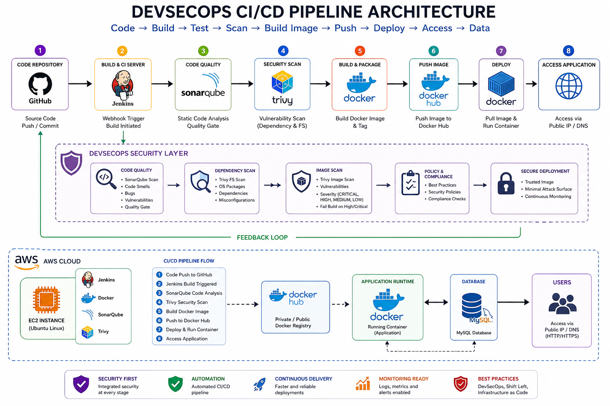
</p>

---

# ☁️ AWS EC2 Instance

The complete DevSecOps environment is hosted on an Ubuntu EC2 instance.

<p align="center">
    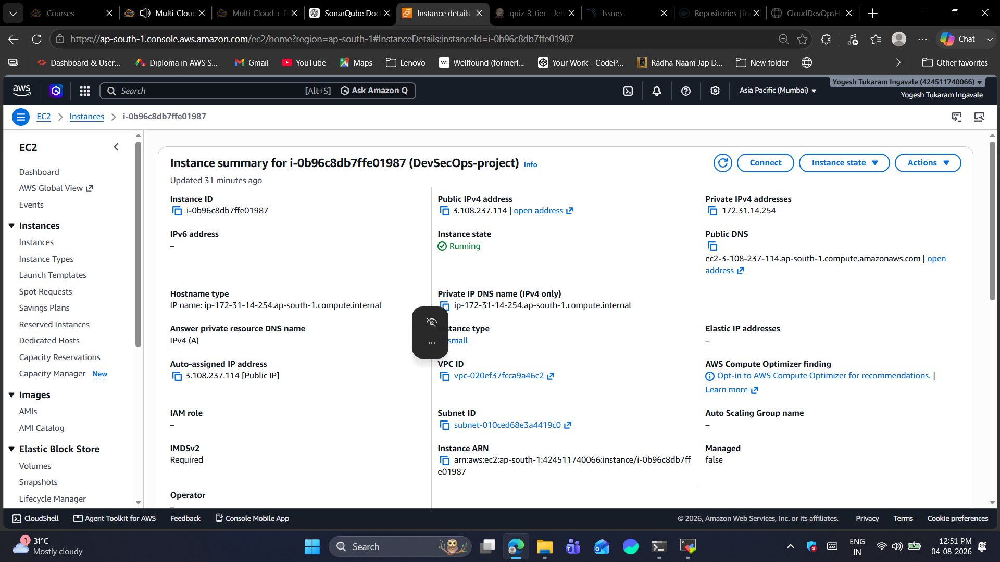
</p>

---

# 🔓 Required Ports

<p align="center">
    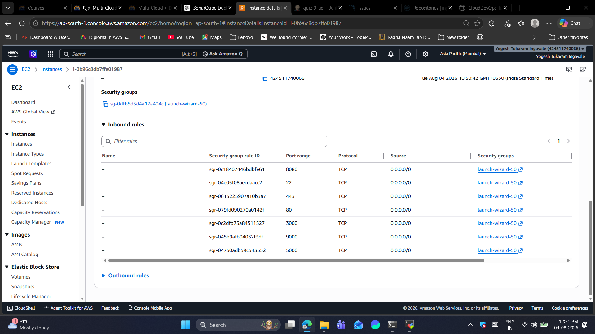
</p>

---

# ⚙️ CI/CD Pipeline Workflow

Pipeline Stages

<p align="center">
    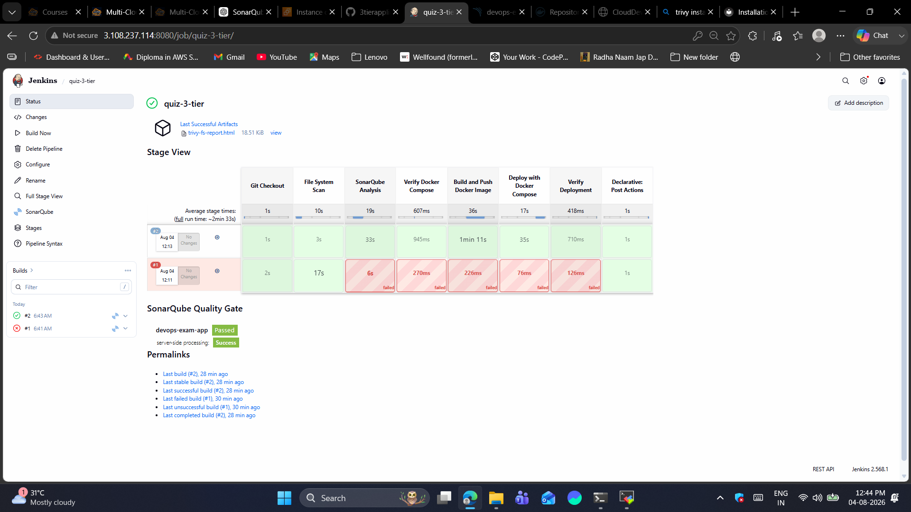
</p>

---

# 🔨 Jenkins webhook

Jenkins automates the complete CI/CD process using declarative pipelines.

<p align="center">
    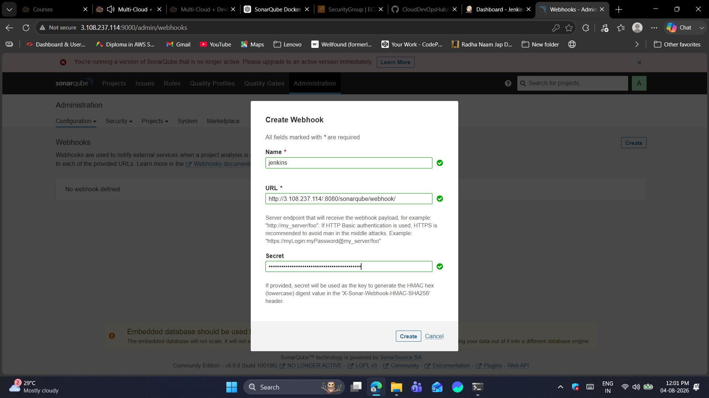
</p>

---

# 🗄️ Database

Application data is stored in the backend database.


<p align="center">
    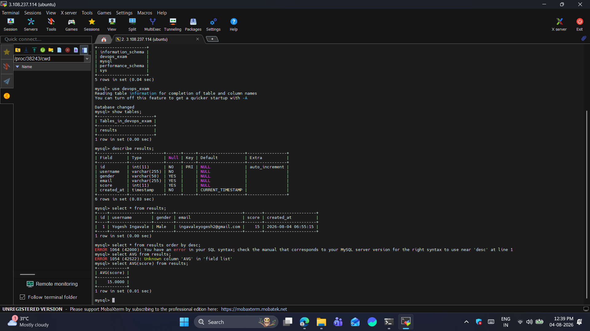
</p>

---

# 🐳 Docker Hub Repository

After successful security scans, Docker images are automatically pushed to Docker Hub.

<p align="center">
    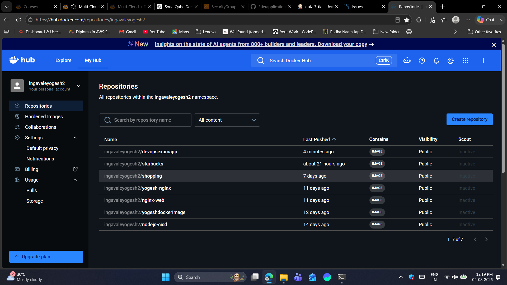
</p>

---

# 📦 Docker Images

Docker images generated during the pipeline.

<p align="center">
    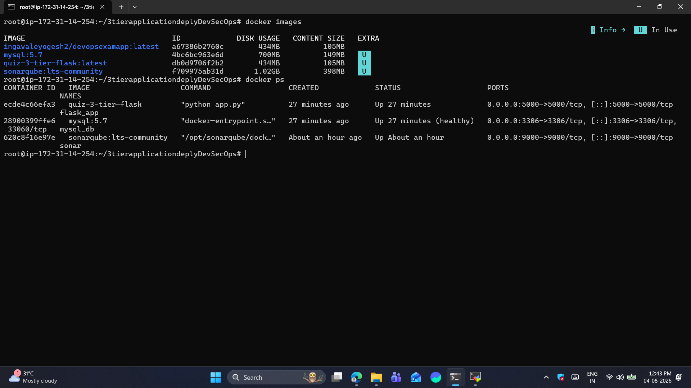
</p>

---

# 🔍 SonarQube Analysis

Static code analysis is performed before deployment.

<p align="center">
    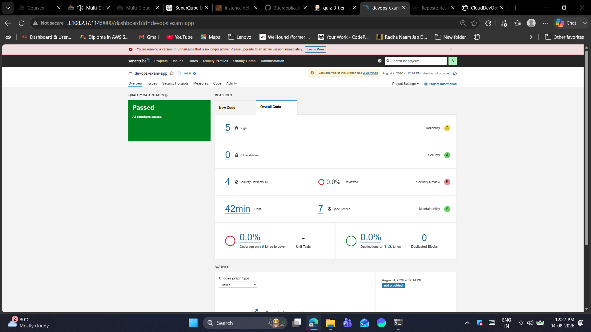
</p>

---

# ✅ Application Testing

Successful application execution after deployment.


<p align="center">
    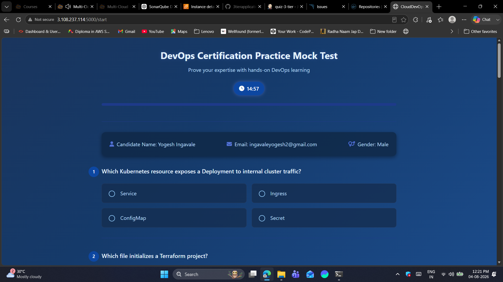
</p>

---

# 🛡️ Trivy Security Scan

Trivy performs vulnerability scanning for both the file system and Docker images.

<p align="center">
    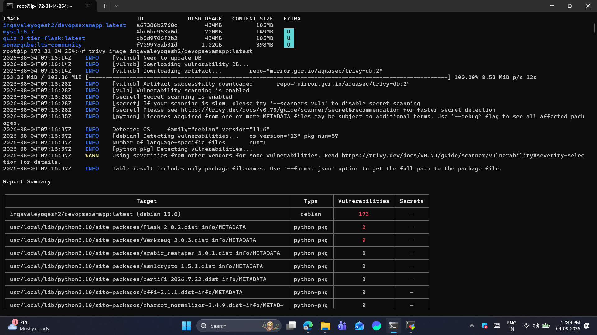
</p>

---

# 🌐 Application UI

Final deployed application running inside a Docker container.

<p align="center">
    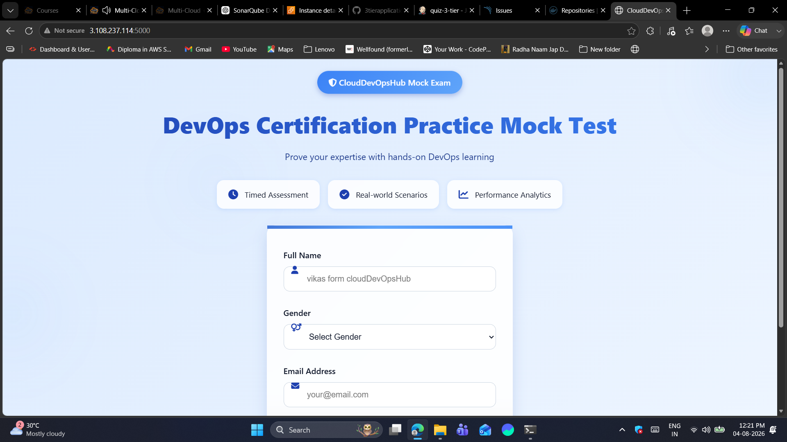
</p>

---


# 🔄 Complete Pipeline Flow

```
Developer
      │
      ▼
GitHub Repository
      │
      ▼
Jenkins Pipeline
      │
      ▼
Build Application
      │
      ▼
SonarQube Analysis
      │
      ▼
Quality Gate
      │
      ▼
Trivy File Scan
      │
      ▼
Docker Build
      │
      ▼
Trivy Image Scan
      │
      ▼
Docker Hub
      │
      ▼
Docker Deployment
      │
      ▼
Application
      │
      ▼
Database
      │
      ▼
Users
```

---

# 📈 Key Features

- End-to-End CI/CD Automation
- DevSecOps Implementation
- Static Code Analysis
- Vulnerability Scanning
- Docker Containerization
- Automated Image Deployment
- Docker Hub Integration
- Continuous Delivery
- Secure Application Deployment

---

# 👨‍💻 Author

**Yogesh Ingavale**

Cloud & DevOps Engineer
